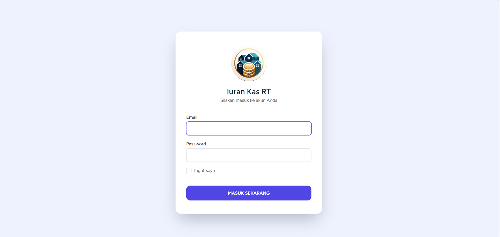
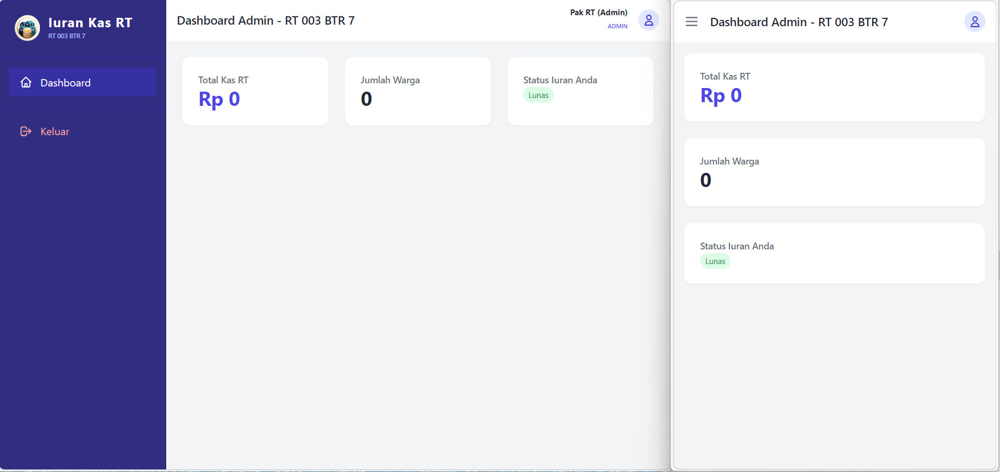
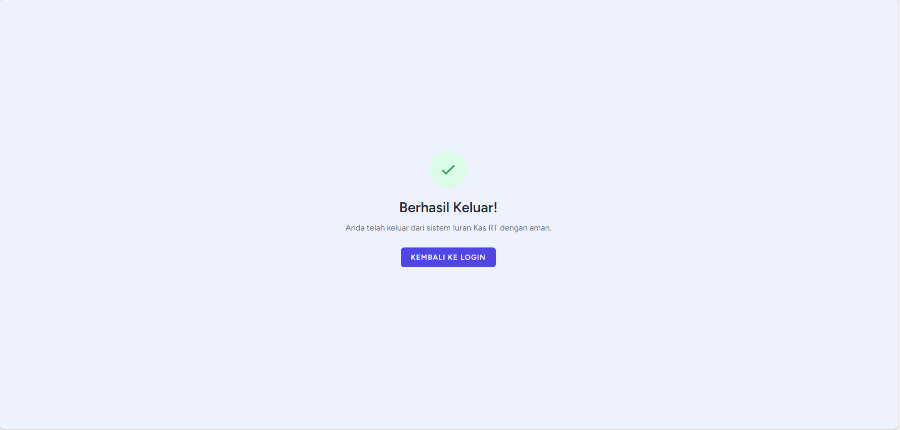
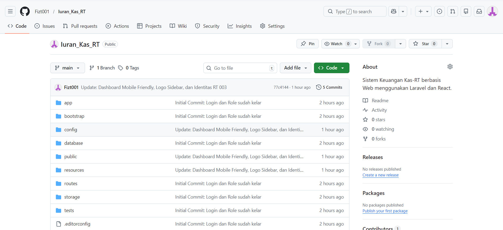

# 🏠 Sistem Manajemen Iuran Kas - RT 003 BTR 7

Sistem informasi berbasis web untuk mengelola iuran kas warga RT 003 BTR 7 secara digital. Dibangun menggunakan **Laravel 12** dengan fokus pada kemudahan penggunaan (User Friendly) dan tampilan yang responsif (Mobile First).

---

## ✨ Fitur Utama
* 🔐 **Multi-Role Authentication**: Mendukung 3 level akses (Admin/Ketua RT, Bendahara, dan Warga).
* 📱 **Mobile-First Dashboard**: Tampilan Sidebar interaktif bergaya aplikasi mobile (e-Rapor style).
* 🎨 **Custom Branding**: Identitas RT dan Logo yang dapat diubah dengan mudah melalui konfigurasi.
* 🚦 **Secure Middleware**: Keamanan akses halaman berdasarkan peran (role) masing-masing user.
* 🚀 **Fast Navigation**: Menggunakan sistem layouting Blade Component untuk performa yang ringan.

---

## 🛠️ Tech Stack
* **Framework**: Laravel 12 (PHP 8.2+)
* **Starter Kit**: Laravel Breeze (Blade)
* **Frontend**: Tailwind CSS & Alpine.js
* **Database**: MySQL / MariaDB
* **Version Control**: Git & GitHub

---

## 🚀 Panduan Instalasi (Lokal)

Jika ingin menjalankan project ini di komputer sendiri, ikuti langkah-langkah berikut:

### 1. Clone Repository
```bash
git clone [https://github.com/Fizt01/luran_Kas_RT.git](https://github.com/Fizt01/luran_Kas_RT.git)
cd luran_Kas_RT
```

### 2. Instalasi Depedency
Pastikan sudah terinstal Composer dan Node.js di laptopmu.
```bash
composer install
npm install
```

### 3. Konfigurasi Environment
Salin file .env.example menjadi .env, lalu sesuaikan database kamu.
```Bash
cp .env.example .env
php artisan key:generate
```

Jangan lupa tambahkan identitas RT di file .env:
```Cuplikan kode
APP_NAME="Kas RT 003"
RT_IDENTITY="RT 003 BTR 7"
```

### 4. Database Migration & Seeder
Pastikan MySQL sudah menyala di XAMPP, lalu buat database bernama kas-rt.
```Bash
php artisan migrate --seed
```

### 5. Menjalankan Aplikasi
Buka dua terminal dan jalankan:
```Bash
# Terminal 1
php artisan serve

# Terminal 2
npm run dev
```

### 📸 Tampilan Dashboard






👤 Author
Hafis (Fizt001) - Lead Developer
GitHub: @Fizt001

Developed with ❤️ for better RT management.